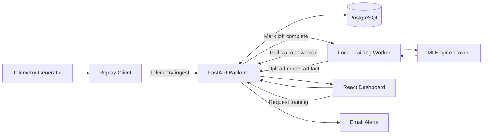
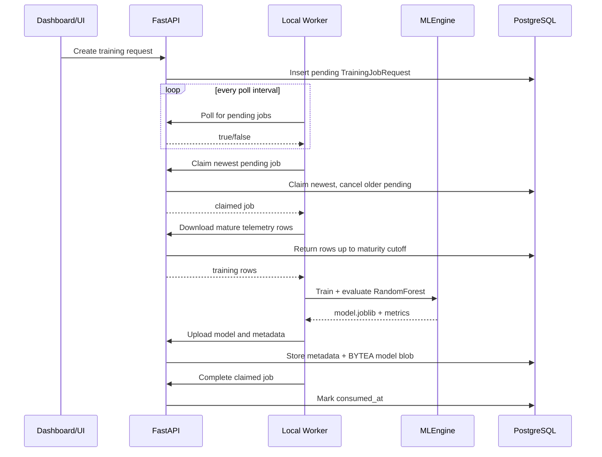
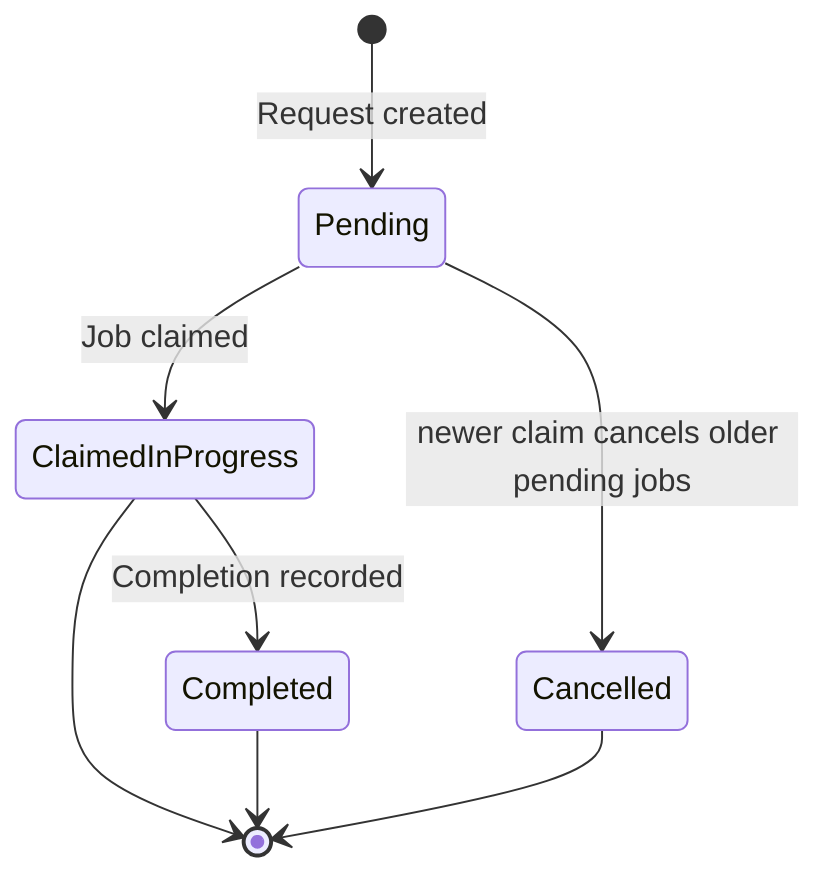

# Pacemaker Telemetry Risk Monitoring Platform

Production-style interview showcase for end-to-end MLOps and full-stack engineering.

This project simulates pacemaker telemetry ingestion, performs patient-level failure-risk inference, runs a delayed-label retraining loop, versions model artifacts with metrics, and serves dashboard-ready data through FastAPI APIs. The system is intentionally demo-focused (synthetic data, non-clinical use), but engineered with real software lifecycle practices (testing, CI, model lineage, rollback-safe promotion).

## Why this project is interview-relevant

- Demonstrates full lifecycle ownership: data simulation -> APIs -> model training/evaluation -> artifact registry -> UI integration.
- Implements a realistic MLOps rule for time-delayed labels (`target_fail_next_7d`) without pseudo-label feedback loops.
- Shows pragmatic reliability controls: claim/complete job semantics, promotion gates, and model traceability metadata.
- Uses production-grade conventions: typed backend, migrations, auth, CI coverage thresholds, and reproducible local workflows.

## Architecture overview



## Training orchestration flow



## Training job lifecycle



## Core capabilities

- **Synthetic telemetry at scale**: daily, multi-patient timelines with failure simulation and engineered features.
- **Robust ingestion API**: bulk ingest with schema validation, duplicate detection, and per-request ingest summaries.
- **Mature-data-only retraining**: supervised retraining uses rows whose forward 7-day outcome windows are resolved.
- **Model artifact registry in PostgreSQL**: model binary (`BYTEA`) + metrics + hyperparameters + source run metadata.
- **Snapshot risk scoring**: latest telemetry row per patient is upserted and scored for dashboard consumption.
- **Alert pathway**: high-risk outputs can trigger email notifications (Mailcatcher locally).

## Tech stack

- **Backend**: Python 3.10+, FastAPI, SQLModel, Alembic, scikit-learn
- **Frontend**: React 19, TypeScript, Vite, Tailwind CSS, TanStack Router/Query
- **Data/ML**: pandas, joblib, RandomForestClassifier (OOB + K-Fold + hold-out metrics)
- **Infra/Tooling**: Docker Compose, `uv`, `bun`, Playwright, Ruff, mypy, Biome, pre-commit hooks

## Local setup and run

### Prerequisites

- Docker + Docker Compose
- `uv`
- `bun`

### 1) Install dependencies (repo root)

```bash
uv sync --all-packages
bun install
```

### 2) Start required services

```bash
docker compose up -d db mailcatcher
```

### 3) Initialize backend (migrations + initial data)

```bash
cd backend && uv run bash scripts/prestart.sh && cd ..
```

### 4) Run backend tests (coverage-enforced in CI)

```bash
cd backend && uv run bash scripts/tests-start.sh && cd ..
cd backend && uv run coverage report --fail-under=90 && cd ..
```

### 5) Run frontend

```bash
cd frontend && bun run dev && cd ..
```

### 6) Optional: generate and replay telemetry

```bash
uv run python backend/util/generate_data.py
```

Acquire a superuser token:

```bash
curl -X POST "http://localhost:8000/api/v1/login/access-token" \
	-H "Content-Type: application/x-www-form-urlencoded" \
	-d "username=<FIRST_SUPERUSER_EMAIL>" \
	-d "password=<FIRST_SUPERUSER_PASSWORD>"
```

Replay to ingest endpoint:

```bash
export TELEMETRY_INGEST_TOKEN="<access_token>"
uv run python backend/util/replay_telemetry.py \
	--endpoint-url http://localhost:8000/api/v1/telemetry/ingest \
	--interval-ms 1000 \
	--verbose
```

### 7) Optional: run local training worker

```bash
uv run python backend/util/training_listener.py --token "<SUPERUSER_JWT>"
```

## API surface (key interview endpoints)

All routes are under `/api/v1`.

- `POST /telemetry/ingest` — bulk telemetry ingestion (1..2000 rows/request, duplicate-safe)
- `POST /training/request` — enqueue pending training job
- `GET /training/poll` — check whether pending jobs exist
- `POST /training/claim` — atomically claim newest pending job and cancel older pending
- `GET /training/download?newest_local_ts=...` — incremental mature-row sync for local trainer
- `POST /training/predict` — refresh latest-patient snapshot and score fail probabilities
- `POST /training/{job_id}/complete` — mark claimed job as consumed
- `POST /models/upload` — multipart upload (`model_file` + `metadata_json`) persisted in PostgreSQL

## ML approach and promotion safety

- **Target**: `target_fail_next_7d` (failure within next 7 days)
- **Features**: core telemetry (`lead_impedance_ohms`, `capture_threshold_v`, `r_wave_sensing_mv`, `battery_voltage_v`) plus rolling means and trend deltas
- **Baseline model**: RandomForestClassifier
- **Evaluation**: OOB score, K-Fold CV, hold-out test accuracy, class-wise precision/recall/F1
- **Guardrail**: no unresolved-label rows for supervised retraining
- **Promotion policy**: activate challenger only when metric gates pass; keep champion on failed runs

## Frontend status

- Frontend is intentionally minimal and near-complete.
- Primary focus of this POC is backend + data + MLOps orchestration depth.
- By demo time, frontend paths are expected to be fully wired to the existing API contracts.

## CI and quality gates

- **Pre-commit**: Ruff, Biome, file hygiene checks, generated-client consistency
- **Backend CI**: PostgreSQL + mailcatcher, migrations/init, pytest, coverage >= 90%
- **Frontend E2E**: Playwright sharded runs in CI
- **Compose smoke**: containerized health checks for backend and frontend
- **Docs quality**: markdown link validation workflow

## Interview demo walkthrough (recommended)

1. Start local stack and show health endpoint.
2. Generate/replay telemetry and observe ingest summaries (inserted vs duplicate counts).
3. Trigger `POST /api/v1/training/request` from UI or API.
4. Run local training worker; show claim/download/train/upload/complete progression.
5. Inspect model metadata/version details from API response or DB-backed views.
6. Run `POST /api/v1/training/predict` and show updated patient risk snapshot.
7. Demonstrate how promotion safety preserves active model quality.

## Repository conventions (important)

- Use `uv` for Python and `bun` for frontend tooling.
- Do **not** use `pip`, `poetry`, `npm`, or `yarn`.
- Do **not** manually edit generated files under `frontend/src/client/`.
- Regenerate frontend API client after backend API/schema changes:

```bash
bash ./scripts/generate-client.sh
```

## Deep-dive documentation index

- [Project scope and architecture](docs/project.md)
- [Pacemaker telemetry feature reference](docs/pacemaker-telemetry.md)
- [Data generator behavior](docs/data-generator.md)
- [Telemetry live replay flow](docs/telemetry-live-replay.md)
- [Telemetry replay local setup](docs/telemetry-live-replay-setup.md)
- [Training loop design (delayed labels)](docs/training_loop.md)
- [Training sync endpoints](docs/training-sync-endpoints.md)
- [Local training worker](docs/local-training-listener.md)
- [Model upload contract + BYTEA storage](docs/model-upload-endpoint.md)
- [MLEngine reference](docs/ml-engine.md)

## Safety and scope notes

- This project is for engineering demonstration only and is not clinical decision support.
- All telemetry is synthetic.
- Design priorities are explainability, traceability, and robust engineering workflow over clinical claims.
